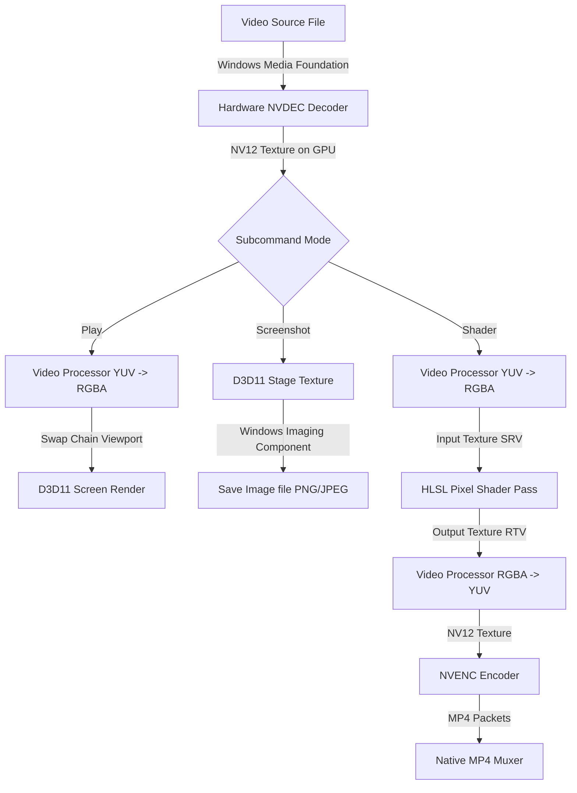
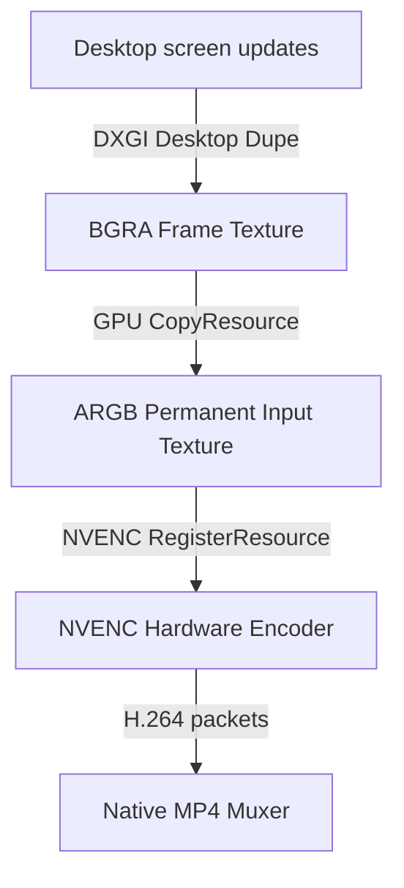

# nanaccel Architecture & Pipeline Flow

This document details the internal workings of the **nanaccel** hardware-accelerated video engine.

---

## 1. High-Level Engine Pipeline

Unlike typical video applications that copy video frames to system RAM to apply operations on the CPU (leading to high CPU usage, bus saturation, and thermal throttling), **nanaccel** implements a zero-copy pipeline on the GPU.

---

## 2. Core Subsystems

### 1. Windows Media Foundation (WMF) Source Reader
Decodes native container formats (like MP4, MOV) using the system's hardware decoder transforms (MFTs).
- Direct3D 11 integration is initialized via `MFCreateDXGIDeviceManager`.
- The device manager shares the D3D11 device context with WMF safely using `ID3D11Multithread` protection to prevent multi-threaded deadlocks.
- Decoded frames are fetched as GPU surfaces (`IMFMediaBuffer`) wrapped in `ID3D11Texture2D` instances.

### 2. Direct3D 11 Processing
All frame sizing and color manipulations are handled on D3D11 hardware contexts:
- **`ID3D11VideoDevice` / `ID3D11VideoContext`**: Runs hardware conversions like scaling and color space translation (e.g. YUV NV12 to RGBA) instantly.
- **Shader Pipeline**: Renders full-screen screen-aligned triangles to execute pixel shaders across input frames without copying them to host memory.

### 3. NVIDIA NVENC
Encodes video streams directly on the GPU silicon:
- Registers the D3D11 texture resource with NVENC using `register_resource_dx11`.
- Performs real-time hardware encoding, outputting Annex B bitstream packets.

### 4. DXGI Desktop Duplication (Screen Recording)
Captures desktop frame updates directly from the graphics subsystem:
- Uses `IDXGIOutput1::DuplicateOutput` to obtain screen frame textures on the GPU (`ID3D11Texture2D`).
- Reuses a permanent registered input texture to avoid allocation/registration overhead.
- Leverages direct GPU-to-GPU memory copies (`CopyResource`) to transfer frames, enabling capture and encoding at 60+ FPS with near-zero CPU overhead.

---

## 3. Screen Duplication Recording Pipeline

